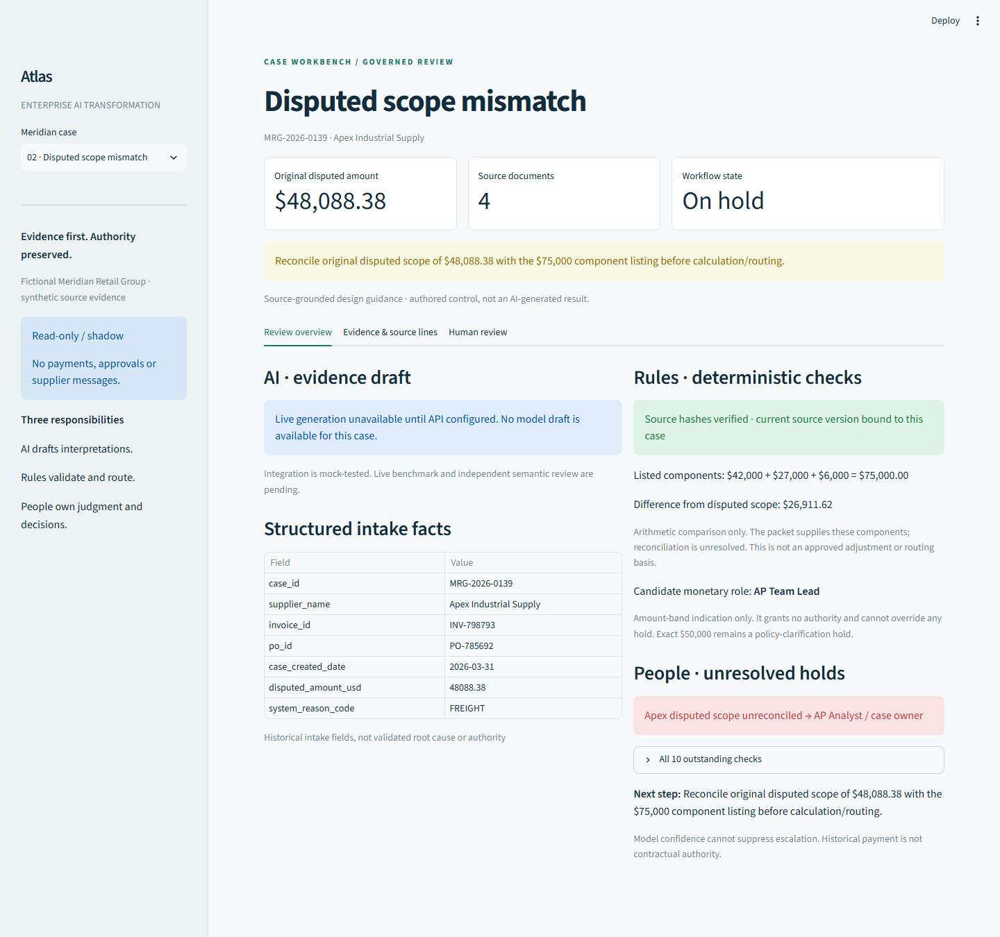
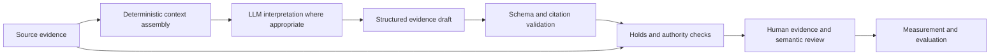

# Atlas — Enterprise AI Transformation Workbench

Atlas is an enterprise AI transformation portfolio project built around fictional Meridian Retail Group's supplier invoice disputes. It connects process diagnosis and source-grounded reasoning to AI opportunity mapping, impact sizing, a proposed operating model and deterministic ROI logic. A read-only case workbench makes the design tangible: bounded model integration prepares cited evidence drafts, deterministic checks preserve holds and authority rules, and people remain responsible for interpretation and decisions.

> Use AI where ambiguity exists. Use deterministic systems where truth can be calculated. Preserve humans where judgment, risk or accountability requires them.

**Status:** working local demonstration; integration ready, live benchmark pending. No API credential was available for this release. No live model quality, production readiness or realized benefit is claimed.

## See the workbench



Start with three cases: conflicting Apex amendments and misleading precedent (0018), Apex's $48,088.38 disputed scope versus $75,000 component listing (0139), and Solara's unresolved 2026 freight terms (0184). All 12 supplied evidence packets are accessible. The demo works offline after dependencies are installed; absent model drafts are clearly labeled.

```sh
python -m venv .venv
```

Activate with `.venv\Scripts\Activate.ps1` in Windows PowerShell or `source .venv/bin/activate` on macOS/Linux, then:

```sh
python -m pip install -r requirements.txt
python -m streamlit run demo/app.py
```

Use Python 3.12 (verified). Open the local address printed by Streamlit. [Five-minute demo guide](demo/README.md).

## What this demonstrates

- Enterprise process diagnosis, evidence traceability and distinction between symptoms and causes.
- Opportunity classification across LLM, deterministic logic, workflow automation, human judgment, process/policy change and hybrid interventions.
- Workflow redesign, failure handling, explicit authority boundaries and controlled deployment sequencing.
- Governed LLM integration, structured output, exact citation validation and separate semantic evaluation.
- ROI design that distinguishes workload, capacity value and cash realization.

## Synthetic business baseline

| Measure | Meridian baseline |
|---|---:|
| Annual invoices / exception rate | ~1,000,000 / 18% |
| Annual disputes | 180,000 |
| Active handling | 23.984 minutes (~24) per dispute |
| Annual active handling | 71,952 hours |
| Active-work FTE equivalent | ~42.3 at 1,700 hours/FTE |
| Team context | 52 FTE / $4.42M annual loaded cost |
| SLA attainment | 62% |
| Average resolution | 6.8 business days |
| Reopen rate | 14% |

These describe a **synthetic baseline, not claimed savings**. Annual volumes and costs are source assumptions; operating metrics come from 250 historical synthetic rows. Annual hours use the unrounded mean: 180,000 × 23.984 / 60 = 71,952. The original sizing report uses a rounded 72,000-hour headline; the public workbench preserves the precise reconciliation. [Quantitative diagnosis](diagnostics/meridian_quantitative_diagnostics.json), [sizing assumptions](impact_sizing/meridian_annualized_impact_sizing.json), [opportunity report](opportunity_mapping/meridian_opportunity_map_report.md).

## Architecture



The generation allowlist contains only case identity/version and numbered source lines. Curated control questions, review flags and evaluator material are excluded. Claims must cite exact source text with hashes and line ranges. The architecture is a proposed governed operating flow; the current app is a local, read-only implementation. [Architecture and workflow](docs/architecture.md).

## AI, rules and people

| Responsibility | Suitable work | Boundary |
|---|---|---|
| AI | Compare clauses, organize evidence, surface contradictions, draft review questions | Suggestions only; no authoritative arithmetic or decisions |
| Deterministic systems | Hashes, calculations, source versions, completeness checks, amount-band routing | Fail closed on unknowns; routing does not grant approval |
| Humans | Ambiguous terms, risk, policy ownership, approvals and accountability | Authenticated authority required in production |
| Workflow / policy | Requests, handoffs, closure records, authoritative policy clarification | Do not disguise process gaps as model problems |

An exact **$50,000** falls into overlapping source-policy bands and stays on hold. Solara's 2026 authority gap stays with **Procurement / Legal**; the unsigned draft is not applied. Apex's component scope requires **case-owner reconciliation**. Historical payment is not authority. Model confidence cannot suppress mandatory escalation. Reviewer flags cannot clear source-level holds. The pilot is **read-only/shadow**, with no financial posting or supplier communication.

## Evaluation

The structural gate checks completed output, strict fields, case version, allowed next steps and exact source citations. Structural validity does not establish factual entailment. An independent semantic reviewer must pass all eight hard gates, score at least 14/16, and give boundary discipline 4/4. The local tool records reviewer attestations; it does not authenticate identity or independence. [Evaluation protocol](evaluation/README.md).

Live attempts: **0**. Semantic reviews of live drafts: **0**. Acceptance rates, usage and model quality remain unknown. The 12 cases informed development and are **not an unseen holdout**. Software fixtures are labeled and excluded from live benchmark accounting. Case-specific evaluator expectations and hidden ground truth are excluded from this public release.

For a later bounded live validation, set `OPENAI_API_KEY` privately in your local environment, choose an available structured-output model, then run:

```sh
python model_integration/live_batch.py --model YOUR_AVAILABLE_MODEL_ID
```

This runs only 0018, 0139 and 0184, at most 4,096 output tokens per case, a 60-second timeout, no retries and no tools. It records exact requested/returned model IDs, response/request IDs, hashes, latency, usage and structural status. Real drafts and pending semantic templates are saved under ignored `runs/live/`. [Live review instructions](model_integration/README.md).

## ROI discipline

```text
Net capacity hours = unique eligible annual cases × adoption
  × (baseline task minutes − intervention minutes including review) / 60
  − annual maintenance hours
```

Overlapping opportunity lenses are not additive. Capacity value ≠ cash savings. A cash benefit requires an explicit realization plan; adoption, review time, maintenance and implementation/run costs must be measured or explicitly sourced. Negative outcomes are retained. The Meridian ROI remains **unestimated** until intervention measurements and governance inputs are supplied. [ROI method](roi_operating_model/roi_method_and_input_guide.md), [actual unsized inputs](roi_operating_model/meridian_roi_inputs.json).

## Repository map

| Folder | Purpose |
|---|---|
| `source_pack/` | Synthetic policies, agreements, 250-row history and 12 evidence packets |
| `diagnostics/` | Reproducible quantitative analysis |
| `reasoning/` | Diagnosis, prompt and schema |
| `impact_sizing/` | Annualized workload lenses and assumptions |
| `opportunity_mapping/` | Intervention taxonomy, map, rules and report |
| `roi_operating_model/` | Deterministic ROI, guards and proposed pilot design |
| `workbench/` | Case assembly, evidence review and measurement logic |
| `model_integration/` | Responses adapter, bounded runner and review gates |
| `evaluation/` | Public rubric, benchmark status and review preparation |
| `demo/` | Local Streamlit application |
| `tests/` | Software, control and demo verification |
| `docs/` | Diagrams, release evidence, provenance and interview materials |

## Verification

```sh
python -m unittest discover -s tests -v
python tests/check_package.py
```

Verified public release: **121 software tests and 267 package checks passed**, plus six browser and six fresh-environment/relocation checks. Full results and limitations are in the [validation report](docs/validation_report.md), with [public-release scrub results](docs/public_release_scrub.md) and the [release checklist](docs/release_checklist.md). Historical development counts are not substituted for public-package validation.

## Limitations and non-claims

Fictional enterprise; synthetic data; no production deployment; no autonomous approval; no measured ROI; no live model-quality claim. Historical dispositions are observations, not correctness labels. Production requires authenticated identity, access control, durable audit, security review, policy/version governance, reliable enterprise integrations, monitoring and domain-approved rollout gates. [Known limitations](docs/known_limitations.md).

## Why this project

Atlas shows how enterprise AI can move from process diagnosis to a governed working POC with measurable deployment questions. It connects strategy to executable controls and evidence review, while keeping the remaining production work visible. [Interview walkthroughs and tradeoffs](docs/interview/README.md).
