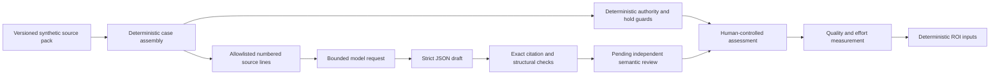
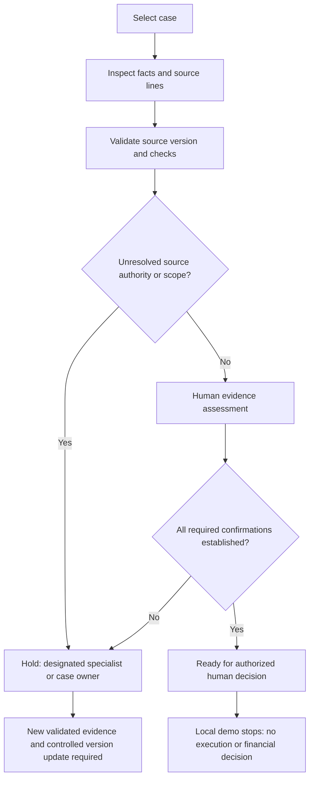

# Architecture and review workflow

The source-specific controls are explicit authored rules grounded in visible packets. They are not model outputs or hidden answer keys. They never enter model generation context. Publication of these controls makes this a transparent development demonstration, not a blind benchmark. An independent evaluator must freeze their private case assessment before reviewing later live output.

The broader operating-model artifact describes future authorized execution stages. The implemented workbench deliberately ends at evidence assessment. Hashes detect changes against local manifests; they are not digital signatures or a production trust service.
